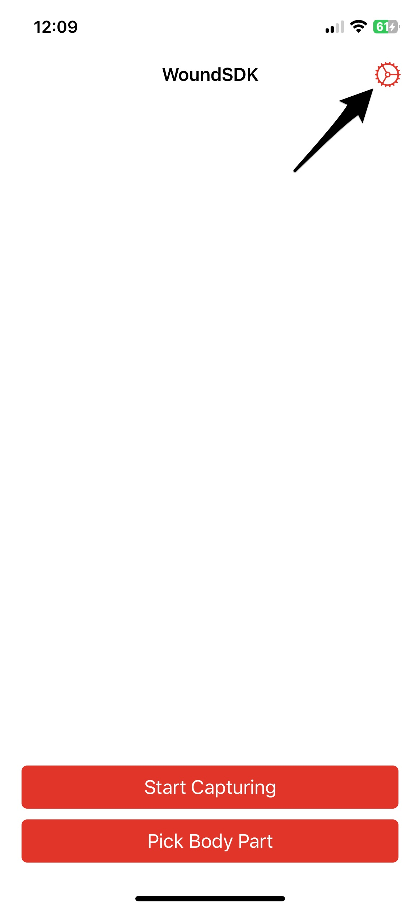
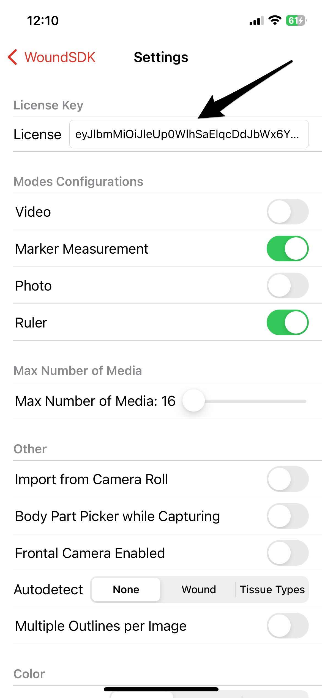
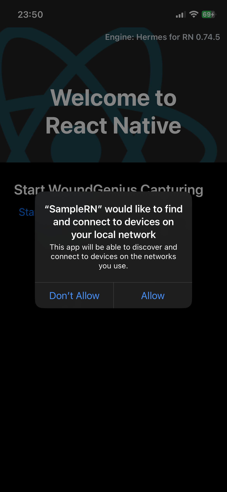
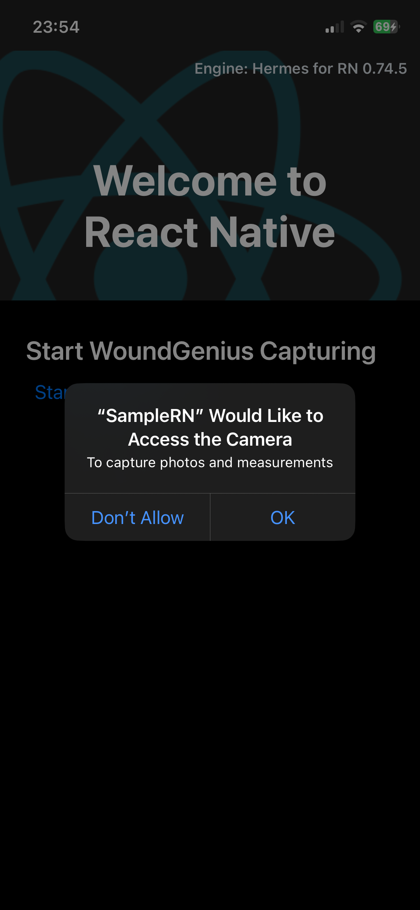
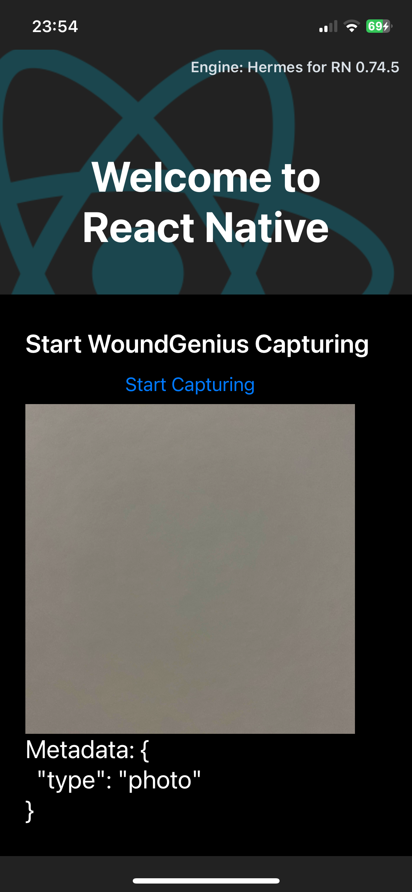

# WoundGenius SDK Sample App

This repository contains the WoundGenius SDK Sample App (Sample folder), the purpose of which is to demonstrate the available features of WoundGenius SDK.
The Sample App is also to be used as a reference app for an iOS team integrating the WoundGenius SDK into their project.

## Initial Setup
To launch the Sample App, perform the following actions:

1. Request the WoundGenius SDK license and request access to the WoundGenius SDK repository for your iOS Developers. Follow the instructions listed here to do that: https://support.imito.io/portal/en/kb/articles/licence-key (You'll need to Sign Up, provide the Bundle Ids you are planning to use, GitHub username of the developers).
2. Download/Pull this Sample app to your machine.
3. In Mac OS Terminal navigate to Sample app folder. To the level where Sample.xcodeproj & Podfile is located.
4. In Mac OS Terminal call **pod install**. TensorFlowLiteTaskVision pod should get installed.
5. In Mac OS Terminal call **open .**.
6. Run the **Sample.xcworkspace** file (Xcode should be installed).
7. Pull the WoundGenius SDK to your machine. Follow the **"Import WoundGenius SDK as a Swift Package"** Section, integrate the WoundGenius SDK into the Sample app. https://github.com/imitoag/woundgenius-ios-sdk/ (Make sure the branch/version matches the Sample App version).
8. While requesting the license, you provided the Bundle Identifiers to be whitelisted. Change the Sample application Bundle Identifier to one of your whitelisted Bundle Identifiers. Also, pick your Apple Development Team in order to be able to launch the Sample application on a real device.
9. Run the application on an iPhone or iPad. (To run the app on Simulator - switch the Target to "SampleSimulator", it won't be possible to test the camera-related features and wound auto-detection features on Simulator.)
10. After you launch the application, go to Settings and paste the license key you've received at Step 1.

   

11. Navigate back from Settings Screen. Click Start Capturing. Grant permission for the app to access the Camera.

# WoundGenius SDK Objective-C Sample App

This repository contains the Objective-C Sample App (SampleObjc folder). The Initial Setup process is similar to the Inital Setup process of the Swift Sample App.

# WoundGenius SDK React Native Sample App

This repository contains the React Native Sample (SampleRN folder).

## Initial Setup
To launch the SampleRN App, perform the following actions:

1. Pull the repository.
2. Navigate to the SampleRN folder.
3. In terminal run a command ```npm install```. That should setup the node_modules. [NodeJS](https://nodejs.org/en/download/package-manager), [Watchman, M1](https://stackoverflow.com/a/70177808/1847511)
4. In terminal navigate to the ios folder. And call ```pod install```. This should create the Pods folder, SampleRN.xcworkspace file.
5. Open the ```SampleRN.xcworkspace``` from the ios folder using Xcode.
6. Pull the WoundGenius SDK to your machine. Follow the **"Import WoundGenius SDK as a Swift Package"** Section, integrate the WoundGenius SDK into the Sample app. https://github.com/imitoag/woundgenius-ios-sdk/ (Make sure the branch/version matches the Sample App version; Make sure that Package is imported to the single Active Xcode project.).
7. While requesting the license, you provided the Bundle Identifiers to be whitelisted. Change the Sample application Bundle Identifier to one of your whitelisted Bundle Identifiers. Also, pick your Apple Development Team in order to be able to launch the Sample application on a real device.
8. Update the license key in Xcode in the ```SampleRN -> WoundGeniusBridge -> WoundGeniusPresenter.swift``` file.
9. Navigate out of ios folder in terminal, to the SampleRN folder. Run the ```npx react-native start``` command in terminal. This should start the dev server usually on port 8081.
10. Switch back to Xcode. Run the iOS app from ```ios``` folder on your device.
11. Allow access to local Network. Click "Start Capturing". Allow access to Camera.

   

13. Capture a photo or marker/ruler measurement. The resulting image and the photo/measuremnet metadata will be displayed as a JSON in React Native Text View, process them according to your needs in your React Native app.




